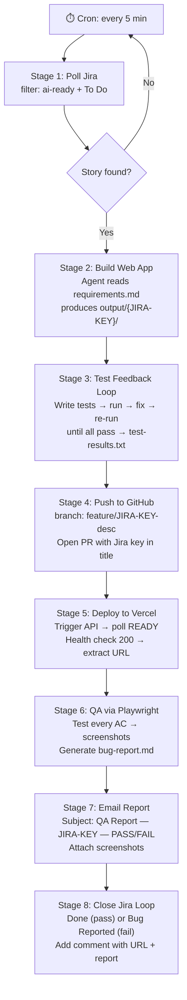

# Zero Human Touch Pipeline — Claude Context

## What this project does
A fully automated, end-to-end software delivery pipeline. A Jira story lands with a `requirements.md` attachment → the pipeline builds a web app, tests it, deploys it to Vercel, QA-tests the live URL via Playwright, emails a bug report, and closes the Jira story — with zero human intervention.

## Architecture



## Key files
- `orchestrator.py` — master script; calls each stage in sequence; catches all errors
- `stages/jira_poller.py` — Stage 1: Jira REST API polling
- `stages/build_agent.py` — Stage 2: spawns Claude Code to build the app
- `stages/test_runner.py` — Stage 3: test write + feedback loop
- `stages/github_pusher.py` — Stage 4: gh CLI wrapper
- `stages/vercel_deployer.py` — Stage 5: Vercel REST API
- `stages/qa_agent.py` — Stage 6: Playwright test runner
- `stages/email_reporter.py` — Stage 7: Resend email sender
- `stages/jira_closer.py` — Stage 8: Jira transitions + comments
- `config.py` — all API keys and project settings (loaded from env)
- `output/{JIRA-KEY}/` — per-story working directory (app code, screenshots, reports)
- `.claude/commands/` — skill files for each stage

## Conventions
- Python 3.11+, managed with `uv` — use `uv run` to execute scripts, `uv add` to add deps
- Type hints throughout
- All secrets via environment variables — never hardcoded
- Every stage logs to `logs/pipeline.log` with ISO timestamps and Jira key prefix
- Every stage must either return a result or raise a typed `PipelineError` with a human-readable message
- On any unhandled error the orchestrator transitions the Jira story to `Bug Reported` with the traceback as a comment — stories never get stuck In Progress
- Output per story: `output/{JIRA-KEY}/` containing `index.html`, `test-results.txt`, `bug-report.md`, `screenshots/`

## Skill files (slash commands)
- `/poll-jira` — Stage 1 instructions
- `/build-webapp` — Stage 2 instructions
- `/test-feedback-loop` — Stage 3 instructions
- `/push-to-github` — Stage 4 instructions
- `/deploy-to-vercel` — Stage 5 instructions
- `/qa-playwright` — Stage 6 instructions
- `/send-report-email` — Stage 7 instructions
- `/close-jira-loop` — Stage 8 instructions

## Environment variables required
```
JIRA_BASE_URL         # e.g. https://yourorg.atlassian.net
JIRA_EMAIL            # Atlassian account email
JIRA_API_TOKEN        # Atlassian API token
JIRA_PROJECT_KEY      # e.g. AI
GITHUB_TOKEN          # Personal access token with repo scope
GITHUB_REPO           # e.g. yourorg/ai-pipeline-output
VERCEL_TOKEN          # Vercel API token
VERCEL_PROJECT_ID     # Vercel project ID
VERCEL_TEAM_ID        # Vercel team ID (optional)
RESEND_API_KEY        # Resend email API key
QA_REPORT_EMAIL       # Destination email for bug reports
```

## Running the pipeline
```bash
# Bootstrap (first time only)
uv init
uv add requests python-dotenv schedule markdown anthropic
npm install        # for Playwright
npx playwright install chromium

# Run once (test)
uv run python orchestrator.py --once

# Run on cron (every 5 min) — add to crontab:
# */5 * * * * cd /path/to/pipeline && uv run python orchestrator.py --once >> logs/cron.log 2>&1

# Or run the built-in scheduler:
uv run python orchestrator.py --schedule
```

## Do not touch
- `output/` — managed entirely by the pipeline; do not manually edit
- `logs/` — append-only log files; do not truncate while pipeline is running
