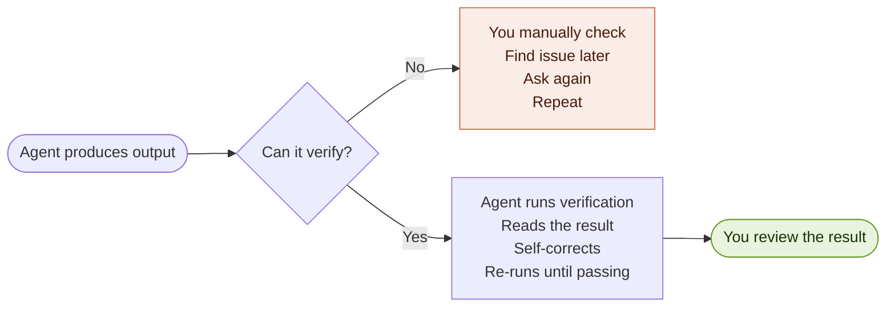
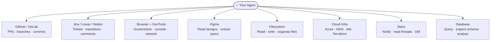
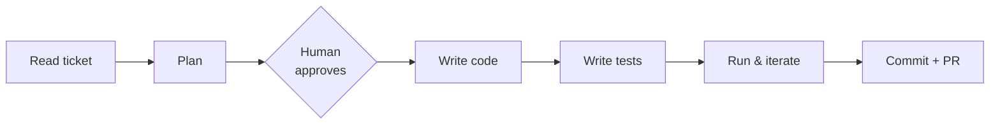
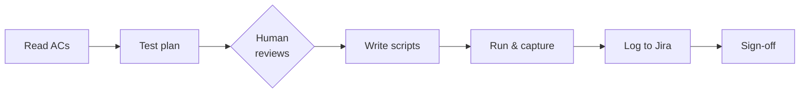
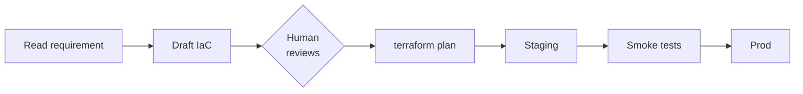
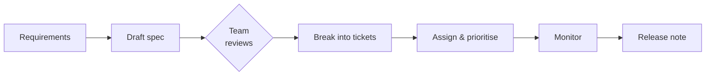
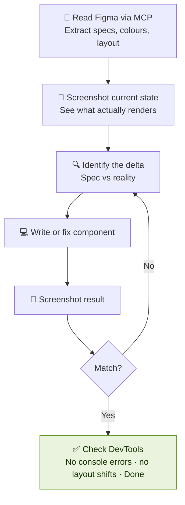
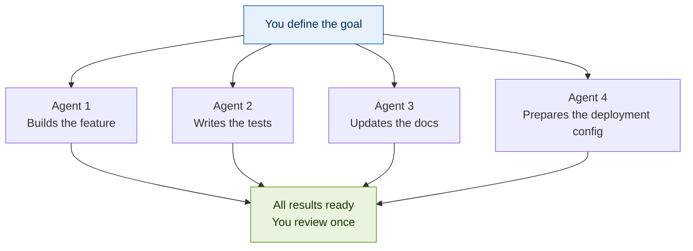

## The 6 Principles of 10X by Tahir Rauf

| # | Principle | The Payoff |
|---|-----------|------------|
| 1 | Agents understand any code in the world | Onboard in minutes, not days |
| 2 | Feedback loops make you 10X | Agents that verify their own work |
| 3 | Tools give agents hands | Agents that can actually do things |
| 4 | Workflows are your identity | Repeatable, reliable, yours |
| 5 | Context quality = output quality | Agents that know your codebase |
| 6 | Parallelism is real 10X | Multiple agents, one goal |

---

---

## Principle 1 — Agents Understand Any Code in the World

> You no longer need to spend days reading a codebase to understand it.
> Your agent can walk you through any repo, any language, any architecture — in minutes.

This applies to everyone, not just developers.

- **Developers** use it to onboard, trace bugs, plan refactors
- **QA** uses it to understand what a feature actually does before writing tests
- **DevOps** uses it to understand what a service deploys and what it depends on
- **PMs** use it to understand what changed between two versions, in plain English

### Questions Worth Asking Your Agent About Any Codebase

**Understanding the repo**
```
"Explain this repository's architecture. What does it do, how is it structured,
and what are the most important files I should know about?"

"Draw me a Mermaid diagram of how the main services interact."

"What is the data flow when a user submits an order?"
```

**Understanding specific code**
```
"Explain this function. What does it do, what are its inputs and outputs,
and are there any edge cases or risks I should know about?"

"What calls this function, and what does it do with the result?"

"What would break if I changed this interface?"
```

**For QA — understanding what to test**
```
"Read this service and give me every possible failure mode.
What are the edge cases a human tester would miss?"

"What are the happy path and all the error paths through this endpoint?"
```

**For DevOps — understanding what runs**
```
"Read this Helm chart and tell me what it deploys, what ports it exposes,
and what it depends on."

"What does this GitHub Actions workflow do, step by step?"
```

**For PMs — understanding what changed**
```
"Summarise the last 30 commits in plain English, grouped by feature area."

"What changed between v1.4 and v1.5 that a non-technical stakeholder should know about?"
```

### The mindset shift

Before AI: *"I need 3 days to understand this codebase before I can touch it."*

After AI: *"Give me 10 minutes with my agent and I'll know exactly where to look."*

---

---

## Principle 2 — Feedback Loops Are What Make You 10X

> This is the single biggest differentiator between a normal AI user and a 10X engineer.
> An agent without a feedback loop is just a fast typist.
> An agent with a feedback loop is an autonomous engineer.

**The principle:** Give your agent the tools to verify its own work, so it can iterate without you.



Without the loop: you are the feedback mechanism. That's a bottleneck.
With the loop: the agent is the feedback mechanism. You just review the outcome.

---

### Verification Tools by Role

**Developers — code correctness**

| Tool | What the agent verifies |
|------|------------------------|
| `npm test` / `pytest` / `vitest` | Tests pass after every change |
| `eslint` / `mypy` / `tsc` | Code is clean and typed |
| `git diff` | Agent reviews what it actually changed |
| Browser DevTools MCP | UI renders correctly, no console errors |
| Playwright MCP | User flows work end-to-end |

**QA — feature correctness**

| Tool | What the agent verifies |
|------|------------------------|
| Playwright | Full user journeys pass |
| Lighthouse MCP | Performance scores meet threshold |
| Axe / accessibility tools | No accessibility violations |
| Network tab inspection | Correct API calls, no unexpected 4xx/5xx |
| Visual diff (Percy, Chromatic) | No unintended UI regressions |

**DevOps — infrastructure correctness**

| Tool | What the agent verifies |
|------|------------------------|
| `terraform plan` | No destructive infra changes |
| `kubectl diff` | K8s config change is safe |
| `docker build` | Image builds cleanly |
| `helm lint` | Chart is valid |
| Health endpoint + curl | Deployed service is actually alive |
| Trivy / Snyk | No critical vulnerabilities in the image |

**Security — vulnerability correctness**

| Tool | What the agent verifies |
|------|------------------------|
| OWASP ZAP MCP | Common web vulnerabilities |
| Semgrep | Static code security analysis |
| Trivy | Container and dependency CVEs |
| `git-secrets` | No secrets committed |

**Performance & Analytics**

| Tool | What the agent verifies |
|------|------------------------|
| Lighthouse CLI | Core Web Vitals scores |
| k6 / Artillery | Load test passes under expected traffic |
| Datadog / Grafana MCP | No metric anomalies after deploy |
| OpenTelemetry traces | No unexpected latency spikes |

---

### Example: Agent With and Without a Feedback Loop

```
WITHOUT a feedback loop
─────────────────────────────────────────────────────────
You:   "Build me a user registration endpoint"
Agent: [writes code, says it's done]
You:   [copy paste → run → crash → debug → 2 hours lost]

WITH a feedback loop
─────────────────────────────────────────────────────────
You:   "Build me a user registration endpoint.
        After writing the code, run the test suite.
        If any tests fail, fix them and re-run.
        Only tell me when all tests are passing."

Agent: [writes code]
       → [runs tests: 3 failures]
       → [reads failure output, identifies root cause]
       → [fixes code]
       → [re-runs tests: all passing]
       → "Done. Here's what I changed and why."

You:   [review a working, tested endpoint — 5 minutes]
```

---

---

## Principle 3 — Tools Give Your Agent Hands

> An agent without tools is like a developer without a computer.
> MCP (Model Context Protocol) is the standard that lets your agent connect to anything.
> The right tools turn your agent from an advisor into a doer.



---

### Tools by Role and Use Case

**Developers**

| MCP Tool | What It Unlocks |
|----------|----------------|
| GitHub MCP | Create branches, open PRs, read diffs, merge — without leaving the agent |
| Figma MCP | Read design specs, extract exact colours/spacing, generate pixel-perfect components |
| Browser + DevTools MCP | Screenshot the UI, read console errors, inspect network calls |
| Database MCP | Query live data to understand what your code actually produces |
| Filesystem MCP | Read, write, organise files across the whole project |

**QA Engineers**

| MCP Tool | What It Unlocks |
|----------|----------------|
| Playwright MCP | Run full browser automation, screenshot results, verify flows |
| Jira / Linear MCP | Read acceptance criteria, write test results back to tickets |
| Postman / API MCP | Send real API requests, validate responses |
| Lighthouse MCP | Run performance and accessibility audits automatically |
| BrowserStack MCP | Run tests across real devices and browsers |

**DevOps**

| MCP Tool | What It Unlocks |
|----------|----------------|
| Kubernetes MCP | `kubectl` operations — get pods, logs, apply manifests |
| Terraform MCP | Plan and apply infra changes from within the agent |
| Datadog / Grafana MCP | Read metrics, check dashboards, query logs |
| Azure / AWS MCP | Manage cloud resources, query cost, check health |
| Docker MCP | Build, run, inspect containers |

**Project Managers**

| MCP Tool | What It Unlocks |
|----------|----------------|
| Jira / Notion / Linear MCP | Create tickets, update statuses, write comments, move cards |
| Slack MCP | Draft updates, read threads, send notifications |
| Google Calendar / Outlook MCP | Schedule meetings, find availability, create events |
| Google Drive / Confluence MCP | Read docs, write specs, update wikis |

**Hiring & Recruiting (bonus use case)**

| MCP Tool | What It Unlocks |
|----------|----------------|
| Unipile | Connect LinkedIn, email, WhatsApp — agent can reach candidates |
| FullyEnrich | Enrich a candidate profile with contact data, company info |
| Apollo / Hunter MCP | Find and verify professional contact details |
| Google Sheets MCP | Maintain a live candidate pipeline with agent-managed updates |

> **The point:** Every department has a set of tools that turns their agent from a text generator into a genuine workflow automator. Find yours.

---

---

## Principle 4 — Workflows Are Your Identity

> Imagination is the only limit on what you can automate.
> Your workflow is how you work — make it yours, feel proud of it, and keep improving it.
> The engineer with the best workflow consistently beats the engineer with the best raw skills.

### The Foundation: One Master Pattern

Every great workflow follows the same shape, regardless of role:

```
Know → Plan → Verify (human) → Execute → Check → Ship
```

The difference is what "execute" and "check" mean for your specific role.

---

### Workflows by Role

**👨‍💻 Developer**



**🧪 QA**



**⚙️ DevOps**



**📋 Project Manager**



---

### The Developer Workflow — Fully Elaborated

This is the most powerful example of a complete agentic workflow.

```
Step 1 — Build Knowledge
  Agent reads: the ticket, the relevant files, the CLAUDE.md, any linked specs
  Agent does NOT start writing code yet

Step 2 — Think & Plan
  Agent produces: a written plan
    - Which files will be changed
    - What the approach is
    - What edge cases to watch for
    - What tests will be written

Step 3 — Human Verification  ← most people skip this and regret it
  You read the plan. You approve or correct it.
  This is your 5-minute investment that saves 2 hours of wrong code.

Step 4 — Generate Code
  Agent implements exactly what was planned
  No surprises — you approved the plan

Step 5 — Write Tests
  Agent writes unit tests, integration tests, edge case tests
  Derived from the acceptance criteria in the ticket

Step 6 — Run & Iterate
  Agent runs the test suite
  Reads failures, understands why, fixes the code
  Re-runs until all passing — no human involved

Step 7 — Screenshot + Visual Verify (for UI work)
  Agent screenshots the result using Browser/DevTools MCP
  Compares to Figma spec
  Iterates until it matches

Step 8 — Commit & PR
  Clean commit message, linked to ticket
  PR description auto-generated with: what changed, why, how to test
```

---

### The UI/Frontend Workflow (with Figma + DevTools MCP)



The agent sees what you see. It doesn't guess — it looks.

---

---

## Principle 5 — Context Quality Equals Output Quality

> A confused agent produces confused output.
> A well-briefed agent produces production-quality output.
> Context is your responsibility — and it's not hard to get right.

The rule: **give your agent enough to understand the task and your conventions — nothing more.**

---

### MD Files Are Your Best Friends

Claude Code reads markdown files automatically from your repo. This is your context layer — and it's hierarchical.

```
Enterprise / Org level
  └── Global rules that apply to every repo
      Coding standards, security rules, language decisions

  Repo level — CLAUDE.md (root of every project)
  └── What this project does, how it's structured,
      key files, commit conventions, test patterns

      Folder level — CLAUDE.md (inside specific folders)
      └── What this module does, specific patterns,
          what not to touch

          Local — claude.local.md (gitignored, your machine only)
          └── Your personal preferences, local paths,
              API keys for dev, tools you prefer
```

**`CLAUDE.md` — what to put in it**

```markdown
## What this project does
One paragraph. Be specific.

## Architecture
Link to a Mermaid diagram or describe the main services.
Which folder does what.

## Key files
- `src/api/` — route handlers, Express router
- `src/services/` — business logic only, no DB here
- `src/models/` — schemas only

## Conventions
- TypeScript, strict mode, no `any`
- Tests live alongside source: `*.test.ts`
- Commits: feat / fix / chore / test prefix
- All functions must have JSDoc

## Running the project
What commands to run, in what order.

## Do not touch
Files or folders that are off-limits and why.
```

> Use Mermaid diagrams inside your CLAUDE.md. Agents can read and reason about them.
> A 10-line architecture diagram saves the agent from misunderstanding your entire system.

---

### Skills — Reusable Agent Superpowers

A **skill** is a markdown file that tells an agent how to do a specific task, step by step.
Write it once. Use it forever. Share it with your team.

**Examples of skills worth building**

| Skill file | What it does |
|------------|-------------|
| `write-tests.md` | How to write tests for this codebase — which framework, what patterns, where files go |
| `code-review.md` | What to check on every PR — security, performance, style, test coverage |
| `deploy-staging.md` | Exactly how to deploy to your staging environment |
| `create-ticket.md` | How to break a feature into well-formed Jira tickets with ACs |
| `incident-response.md` | How to triage a production incident — what to check first, how to escalate |
| `write-changelog.md` | How to turn a set of commits into a human-readable release note |

**Three sources of skills**

1. **Build your own** — codify what you already do well. Your best work, turned into a repeatable process.
2. **Share with your team** — when you have a great skill, your team inherits it instantly. Skills compound.
3. **Use industry-proven skills** — the AI community publishes battle-tested skills for common engineering tasks. Don't reinvent what's already great.

> Your skills library is part of your engineering identity. A team with good skills moves faster than a team with better raw talent.

---

---

## Principle 6 — Parallelism Is Real 10X

> One agent working sequentially is faster than working alone.
> Multiple agents working in parallel is a different category entirely.
> This is where 10X becomes real.

The tools that make this possible: **Warp, tmux, Claude Code multi-agent, git worktrees.**

---

### The Parallel Agent Model

Instead of one agent doing everything in sequence, you spawn multiple agents — each focused on one thing — and they work simultaneously.



What used to take 4 hours sequentially now takes the time of the longest single task.

---

### The Tools That Enable This

**Warp — the terminal built for AI**

- Run multiple Claude Code sessions in split panes simultaneously
- Each pane is its own agent, its own context, its own task
- AI-native: command autocomplete, natural language to command, shared context
- Built for exactly this kind of multi-agent terminal workflow

**tmux — the original parallel terminal**

- Create multiple windows and panes in one terminal session
- Attach and detach from long-running agent sessions — agent keeps working while you're away
- Script your session layout: `tmux new-session`, `split-window`, launch agents in each pane
- Essential for running agents in the background on a server or remote machine

**Git Worktrees — parallel branches, no stashing**

```bash
# Instead of switching branches and losing context:
git worktree add ../project-feature-auth feature/auth
git worktree add ../project-feature-payments feature/payments

# Now you have two complete working copies of the repo
# Agent 1 works in ../project-feature-auth
# Agent 2 works in ../project-feature-payments
# No conflicts. No stashing. No waiting.
```

Worktrees are the unlock for true parallel agent development. Each agent gets its own isolated working copy of the repo. They can build, test, and commit independently.

---

### What to Parallelise — by Role

**Engineering**

```
Goal: Ship a feature

Agent 1 → Read Figma, build the UI component
Agent 2 → Build the API endpoint
Agent 3 → Write unit and integration tests
Agent 4 → Update the API docs and changelog
Agent 5 → Prepare staging deployment config
```

**Project Management**

```
Goal: Kick off a new project

Agent 1 → Draft the project spec and requirements doc
Agent 2 → Break requirements into Jira epics and tickets
Agent 3 → Draft the communication plan and stakeholder update
Agent 4 → Generate the project plan with milestones
Agent 5 → Identify risks and open questions
```

**Hiring / Recruiting**

```
Goal: Source and engage candidates for a role

Agent 1 → Search and shortlist candidates via Unipile + FullyEnrich
Agent 2 → Enrich profiles with contact data and background
Agent 3 → Draft personalised outreach messages per candidate
Agent 4 → Update the candidate tracker in Notion/Sheets
Agent 5 → Schedule intro calls via Calendar MCP
```

**Security & Compliance**

```
Goal: Pre-release security review

Agent 1 → SAST scan with Semgrep
Agent 2 → Container vulnerability scan with Trivy
Agent 3 → DAST scan on staging with OWASP ZAP
Agent 4 → Check for secrets in git history
Agent 5 → Generate the security review report
```

---

### The Mental Model

Stop thinking: *"What should my agent do next?"*
Start thinking: *"What can all my agents do simultaneously, right now?"*

Every hour you work sequentially is an hour you're leaving on the table.

---
